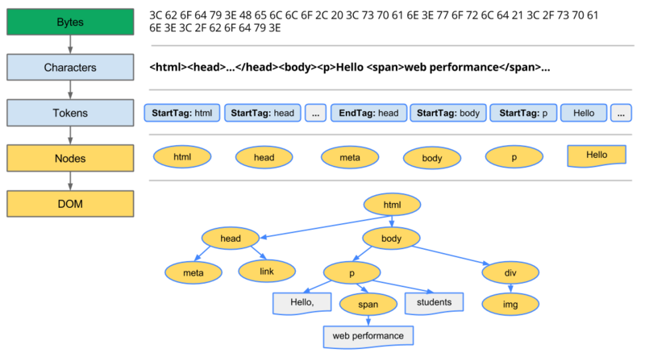
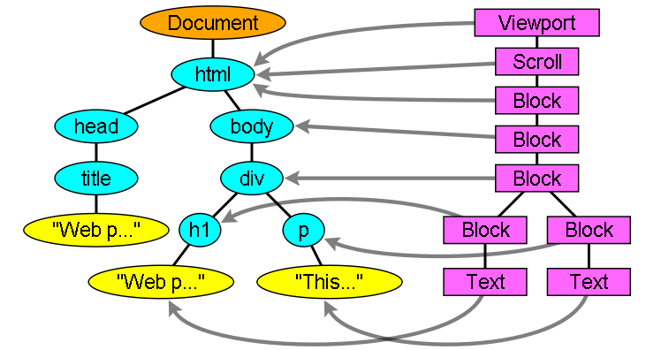

### 服务器端响应http请求，浏览器得到html代码，渲染引擎通过请求文档的内容来进行渲染；

####  先解释几个概念
  * DOM Tree：浏览器将HTML解析成树形的数据结构

  > Document Object Model

 

  上图展示了从html的字节码被浏览器处理为DOM的过程

    1. 转换：根据字节的编码规则将其转化为特定字符，也就是characters

    2. 生成tokens：将character转化为w3c定义的各种特定标签 ，生成tokens（令牌）

    3. 词法解析：匹配字符串，将tokens按照规则转换为包含特定属性和规则的节点对象（nodes）

    4. DOM构建：根据每个节点的层次关系和规则转换为直观的树形结构，具有明确的父子关系。

  注意：HTML都是增量构建的，在HTML文件还在传输时html parse就可以开始了

  最终我们得到了页面完整的DOM（文档对象模型），在以后的页面渲染包括布局、绘制等都会用到它。它代表了页面的结构，决定了整个页面的初始格局
  
* CSSOM：浏览器将CSS解析成树形的数据结构

  > CSS Object Model

  
 
   *上图是CSSOM构建流程图，跟DOM构建差不多的套路，将CSS文件的字节码转换为符合浏览器特定规则的字符，然后浏览器对其进行解析和构成树*

  *与 DOM有所不同的是，其整个的计算过程略有复杂，包括一套复杂的特异度计算规则（CSS属性来源 -> 特异度大小 -> 书写顺序前后覆盖），最终确定每个节点的样式值形成下图的不完整 CSSOM*
  
  

  上面的CSSOM（CSS对象模型）决定了页面的五彩斑斓

* Render Tree: 浏览器的Render过程将DomTree和CSSOM组合到一起，生成RenderTree;如下图
 
   

  > 一般情况下，对于每一个节点，会有一个block与之对应，占用一个矩形框，并且矩形框可以嵌套；当首先检测到html元素的时候，浏览器认为该节点是根节点，会将其作为ViewPort，也就是页面的最初包含的block

  > 但是对于不可见的元素不会在Render Tree中出现；比如 header 标签；还有diplay等于none的元素

  

  > 注意：visibility等于hidden的元素是会显示在Render Tree里的;因为这种使用隐藏方式的标签还是在文档流里的

  > 有些DOM元素却对应了好几个renderer，并且这种情况是普遍存在的，就是为了解决一个renderer描述不清楚如何显示出来的问题；比如 select 元素需要三个renderer，one for the display area, one for the drop down list box and one for the button

  > renderer与dom元素的位置也可能是不一样的情况，比如添加了 float 样式的元素，还有display 为absolute 的元素；因为它们脱离了正常的文档流顺序，构造Render树的时候会针对它们实际的位置进行构造

  * layout: 有了Render Tree，浏览器已经能知道网页中有哪些节点、各个节点的CSS定义以及他们的从属关系，从而去计算出每个节点在屏幕中的位置，来进行布局，布局使用流模型的Layout算法

  > 所谓流模型，就是指Layout的过程只需进行一遍即可完成，后出现在流中的元素不会影响前出现在流中的元素，Layout过程只需从左至右从上至下一遍完成即可；但实际实现中，流模型会有例外。

  > Layout是一个递归的过程，每个节点都负责自己及其子节点的Layout，Layout结果是相对父节点的坐标和尺寸；比如
  >> 父节点确定自己的宽度
  >>父节点完成子节点放置，确定其相对坐标
  >>节点确定自己的宽度和高度
  >>父节点根据所有的子节点高度计算自己的高度

  * painting: 按照算出来的规则，通过调用操作系统Native GUI的API绘制，把内容画到屏幕上。

#### 下图是页面渲染的基本流程
  
  

1. 渲染引擎开始解析html文档，根据标签构建DOM节点

  > DOM 树的构建过程是一个深度遍历过程：当前节点的所有子节点都构建好后才会去构建当前节点的下一个兄弟节点

2. 遇到css样式如link标签或者style标签时开始解析css，构建构建渲染树

  > 这里包括的是元素的大小、颜色，而隐藏的元素不会被构建到该树中

3. 根据css样式绘制的渲染树，确定各个元素要显示的具体位置

  > renderTree构建完毕之后，不过浏览器渲染引擎并不直接使用渲染树进行绘制，为了方便处理定位（裁剪），溢出滚动（页内滚动），CSS转换/不透明/动画/滤镜，蒙版或反射，Z （Z排序）等，浏览器需要生成另外一棵树 - 层树。因此绘制过程如下： 
  >> 获取 DOM 并将其分割为多个层(RenderLayer) 
  >> 将每个层栅格化，并独立的绘制进位图中 
  >> 将这些位图作为纹理上传至 GPU 
  >> 复合多个层来生成最终的屏幕图像(终极layer)

4. Layout后，浏览器已经知道了哪些节点要显示（which nodes are visible）、每个节点的CSS属性是什么（their computed styles）、每个节点在屏幕中的位置是哪里（geometry）。就进入了最后一步：Painting，按照算出来的规则，通过显卡，把内容画到屏幕上

  注意
  > 上述这个过程是逐步完成的，为了更好的用户体验，渲染引擎将会尽可能早的将内容呈现到屏幕上，并不会等到所有的html都解析完成之后再去构建和布局render树。它是解析完一部分内容就显示一部分内容，同时，可能还在通过网络下载其余内容

  根据上述步骤的解释再来看下面 Webkit 内核的流程图

  

   接着是 Gecko 内核术语略有不同，但整体流程是基本相同的流程图

  

  PS.DOM、CSSOM、Render Tree都可能在第一次Painting后又被更新多次
  > JS修改了DOM或者CSS属性。

  Layout 和 Painting 也会被重复执行
  > 除了DOM、CSSOM更新的原因外，图片下载完成后也需要调用Layout 和 Painting来更新网页

#### 由此引出了两个概念，重绘和回流

  1. repaint（重绘）：改变某个元素的背景色、文字颜色、边框颜色等等不影响它周围或内部布局的属性时，屏幕的一部分要重画，但是元素的几何尺寸没有变。比如：
 
 * background-color,
 * border-color
 * visibility
  
  2. reflow（回流）：当浏览器发现页面某个部分发生了变化影响了布局，需要倒回去重新渲染， 这个回退的过程叫 reflow。通常由以下改变触发：

 * DOM 操作（如元素增、删、改或者改变元素顺序）
 * 内容的改变，包括 Form 表单中文字的变化
 * 计算或改变 CSS 属性
 * 增加或删除一个样式表
 * 浏览器窗口的操作（改变大小、滚动窗口）
 * 激活伪类（如:hover状态）

  从上面可以看出 reflow(回流)和 repaint(重绘)对于浏览器的性能都有较大的影响，当然reflow的成本比repaint的成本高好多。那么，浏览器为了避免成本增加，从而优化了渲染方式
1. 浏览器尽最大努力限制重排的过程仅覆盖已更改的元素的区域

       > 一个 position 为 absolue 或 fixed 的元素的大小变化只影响它自身和子孙元素，而对一个 position 为 static 的元素做同样的操作就会引起所有它后面元素的重排

    2. 当运行一段通过Jjavascript  操作元素代码的时候，浏览器会将一些修改缓存起来，然后当代码执行的时候，一次性的将这些修改执行。
  举例来说，下面这段代码会触发一次重绘和一次重排：
  
  ```js
  var bstyle = document.body.style; // cache
  bstyle.padding = "20px"; // reflow, repaint
  bstyle.border = "10px solid red"; //  再一次的 reflow 和 repaint
  bstyle.color = "blue"; // repaint
  bstyle.backgroundColor = "#fad"; // repaint
  bstyle.fontSize = "2em"; // reflow, repaint
  // new DOM element - reflow, repaint
  document.body.appendChild(document.createTextNode('dude!'));
  ```
  
  *事实上浏览器不会像上面那样，你每改一次样式，它就reflow或repaint一次。*

  *一般来说，浏览器会把这样的（都是设置style属性，而不涉及其他类似读取属性的操作）操作积攒一批，然后做一次reflow，这又叫****异步reflow****或****增量异步reflow****。
  
  *是有些情况浏览器是不会这么做的，比如：resize窗口，改变了页面默认的字体，等。对于这些操作，浏览器会马上进行reflow*

  *但是有些时候，我们的js脚本会阻止浏览器这么干。比如：如果我们请求下面的一些DOM值：（比如我们在上面的例子中若加一个读取属性的操作则会引起又一次的重排*
 * offsetTop, offsetLeft, offsetWidth, offsetHeight

 * scrollTop/Left/Width/Height

 * clientTop/Left/Width/Height

 * IE中的 getComputedStyle(), 或 currentStyle

  *因为，如果我们的程序需要这些值，那么浏览器需要返回最新的值，而这样一样会flush出去一些样式的改变，从而造成频繁的reflow/repaint。*

#### 除此之外还有

  1. onload事件

 > 当 onload 事件触发时，页面上所有的DOM，样式表，脚本，图片，flash都已经加载完成了
 
  2. DOMContentLoaded 事件

  > 当 DOMContentLoaded 事件触发时，仅当DOM加载完成，不包括样式表，图片，flash

  3. 首屏时间
   
  > 当浏览器显示第一屏页面所消耗的时间，在国内的网络条件下，通常一个网站，如果“首屏时间”在2秒以内是比较优秀的，5秒以内用户可以接受，10秒以上就不可容忍了

  4. 白屏时间

  > 指浏览器开始显示内容的时间
  但是在传统的采集方式里，是在HTML的头部标签结尾里记录时间戳，来计算白屏时间
  在这个时刻，浏览器开始解析身体标签内的内容
  而现代浏览器不会等待CSS树（所有CSS文件下载和解析完成）和DOM树（整个身体标签解析完成）构建完成才开始绘  制，而是马上开始显示中间结果
  所以经常在低网速的环境中，观察到页面由上至下缓慢显示完，或者先显示文本内容后再重绘成带有格式的页面内容

#### CSS 阻塞渲染

  > CSSOM形成前，**浏览器不会渲染任何已处理内容**，所以CSS被视为阻塞渲染的资源

  那么说明

  1. css加载不会阻塞DOM树的解析 
  2. css加载会阻塞DOM树的渲染 
  3. css加载会阻塞后面js语句的执行

解决CSS阻塞的问题的几个方向：

  * 网速
  * 大小
  * 尽早并行下载
  * 尽早开始构建CSSOM
  * 构建CSSOM的速度

解决方案
  
  1. 媒体查询 

  虽然媒体查询也下载全部CSS代码，但是只会解析符合媒体查询条件的代码，这就做到了尽量少的阻塞渲染。

  2. preload
  
  ``` html
  <link rel="preload" href="index_print.css" as="style" onload="this.rel='stylesheet'">
``` 
 preload是resoure hint规范中定义的一个功能，也就是预加载，将rel改为preload后，相当于加了一个标志位，浏览器解析的时候会提前建立连接或加载资源，做到尽早并行下载，然后在onload事件响应后将link的rel属性改为stylesheet即可进行解析
 
  > Resource Hint实际上就是“合法化”的提供了使用浏览器原始语言来进行的一些提前预测行为的能力，W3C也陆续增加了很多功能，preload只是其中的之一

  3. 动态添加link
  
  ``` js
  var style = document.createElement('link');
  style.rel = 'stylesheet';
  style.href = 'index.css';
  document.head.appendChild(style);
```
  js动态添加DOM元素link，不会阻塞渲染

  loadCSS.js，CSS preload polyfill第三方库，用的就是这个原理

  4. 将CSS放在head

  > 将CSS放在head，不管内部样式表还是外部央视白哦都会尽早开始下载或者构建CSSOM

  5. 避免使用CSS import
  
  > 在CSS中可以用import将另一个样式表引入，不过这样显然在构建CSSOM时会增加一次网络来回时间

  6. 适度内联CSS

  > 衡量其他因素，比如外联网络来回影响多大，HTML的大小，CSS的大小

#### 如果渲染过程中遇到了js代码
  
   不同于css文件，js是阻塞式的加载，当浏览器在执行js代码时，不会做其他的事情。只有js代码执行后，才会继续渲染页面。

  ***由此看来，最好把js放到页面的底部***